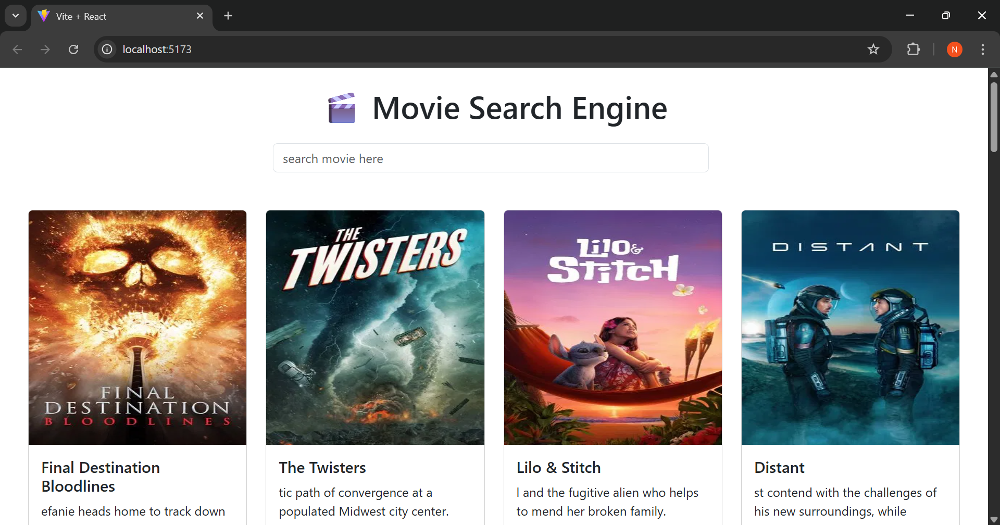

# 🎬 Movie Search App

A React-based movie search application using the TMDB API. Users can view popular movies and search for any movie by title. Shows a 404 image if no movie is found.

## 🚀 Features
- Search movies in real-time using TMDB API
- Display popular movies by default
- Responsive Bootstrap layout
- 404 image when no results are found
- Clean card layout with poster, title, overview, and release date

## 🛠️ Tech Stack
- React
- Vite
- Axios
- TMDB API
- Bootstrap 5

## 📸 Screenshot



## 🧑‍💻 How to Run Locally
```bash
git clone https://github.com/nazrinayesha/movie-search-app.git
cd movie-search-app
npm install
npm run dev
